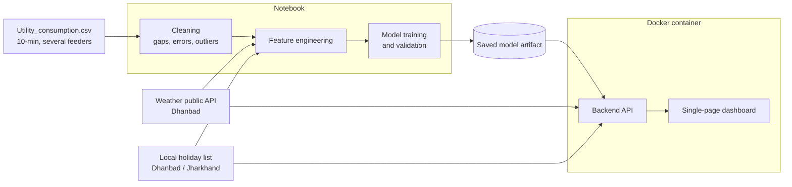

# ARCHITECTURE: Intelligent Power Demand Forecasting

Legend: **Required** = stated in the brief. **Proposed** = a structuring choice made here, not stated in the brief. **Open** = decision not yet made.

## 1. Required components
| Component | Requirement from the brief |
|-----------|----------------------------|
| Jupyter Notebook | EDA, data cleaning, feature engineering, model justification; documents the whole process |
| Model artifact | Trained model saved to file (e.g. `.pkl` or `.h5`) |
| Backend API | Loads the saved artifact; serves a 24-hour forecast; serves weather (temperature, humidity, cloud cover) and local holiday data for the forecast period |
| Frontend | Single-page app calling the API; interactive forecast chart; weather and holiday visualizations |
| Container | Dockerfile; project must be "container-deployable" |
| Docs | `README.md` with build and run instructions |

## 2. Data sources
| Source | Detail from the brief |
|--------|-----------------------|
| `Utility_consumption.csv` | Provided; several feeders; 10-minute intervals; contains gaps, errors, outliers |
| Weather | Public API; Dhanbad, Jharkhand, India; temperature, humidity, cloud cover, wind speed |
| Holidays | Self-sourced; festive and industrial; Dhanbad/Jharkhand specific |

## 3. Data flow **(Proposed)**

The brief requires the notebook, the saved artifact, the API and the dashboard. Whether the frontend is served by the API or by a separate service is **Open**; the brief only requires that the whole project can be built and run via Docker and the README.

## 4. API surface
The brief requires two capabilities. Route names and response schemas are **Open**.
| Capability | Brief requirement | Proposed route |
|-----------|-------------------|----------------|
| Forecast | Load model, return a fresh forecast for the next 24 hours | `GET /forecast` |
| Weather for forecast period | Temperature, humidity, cloud cover | `GET /weather` |
| Holidays for forecast period | Localized holiday data | `GET /holidays` |

The brief says "endpoints", so weather and holidays may be one endpoint or two. Block count in the forecast response depends on the 48 vs 96 question (see MEMORY.md).

## 5. Technology choices
| Layer | Options named in the brief | Decision |
|-------|---------------------------|----------|
| Backend framework | FastAPI, Flask, Node.js/Express | **Open** |
| Charting library | Chart.js, D3.js "or similar" | **Open** |
| Model format | `.pkl` or `.h5` (examples) | **Open** |
| Model architecture | Not named; must be justified with EDA | **Open** |
| Weather API | "a public API" | **Open** |
| Containerization | Docker | **Required** |

## 6. Repository layout **(Proposed)**
The brief only lists what the repo must contain. This layout is a suggestion:
```
.
├── README.md
├── Dockerfile
├── data/                 # Utility_consumption.csv, holiday list
├── notebooks/            # EDA, cleaning, features, model justification
├── models/               # saved model artifact
├── backend/              # API code
└── frontend/             # single-page dashboard
```

## 7. Constraints that shape the design
- Model target granularity is 30-minute blocks while source data is 10-minute, so the notebook must define how 10-minute data maps to the target blocks. The method is **Open**.
- The API must produce a "fresh" forecast, and weather data is needed for the forecast period, so the backend needs access to weather data for that period at request time or from a stored copy. Which one is **Open**.
